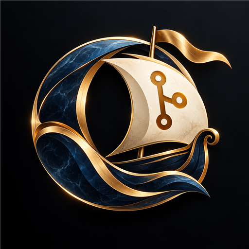
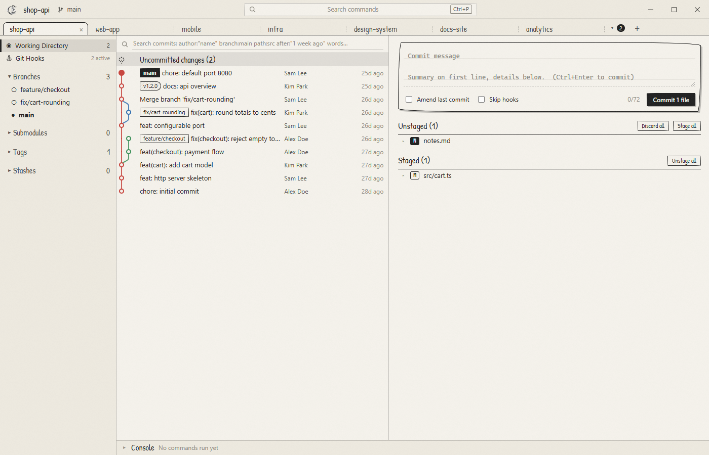
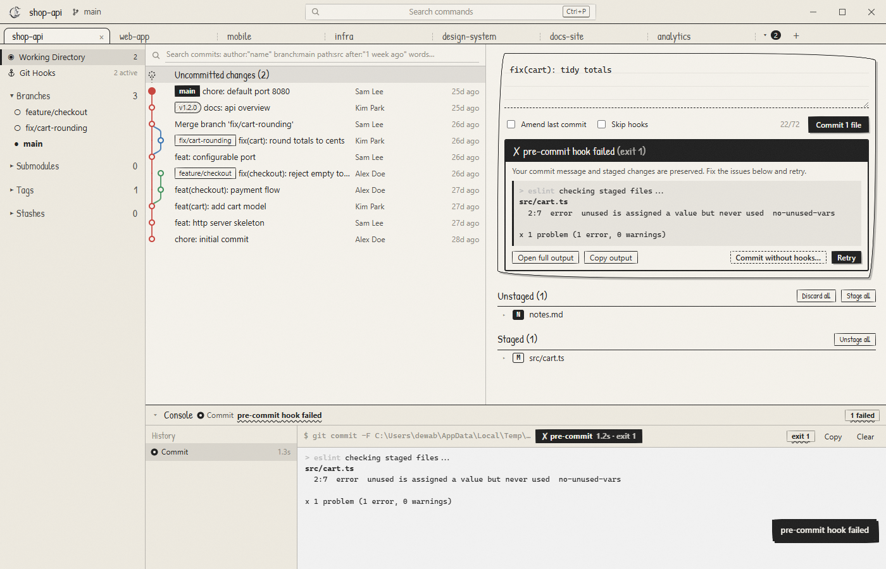
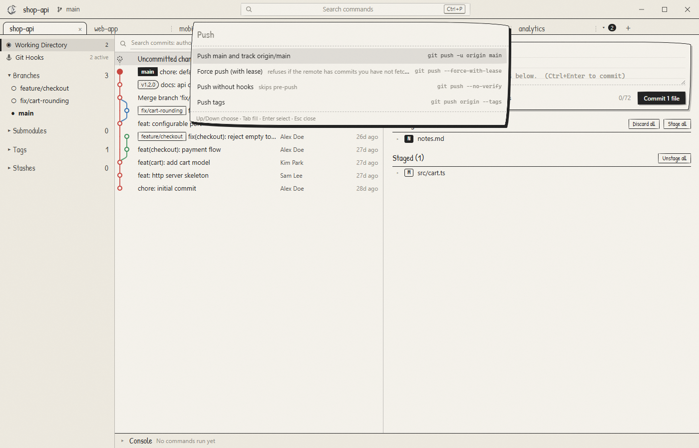
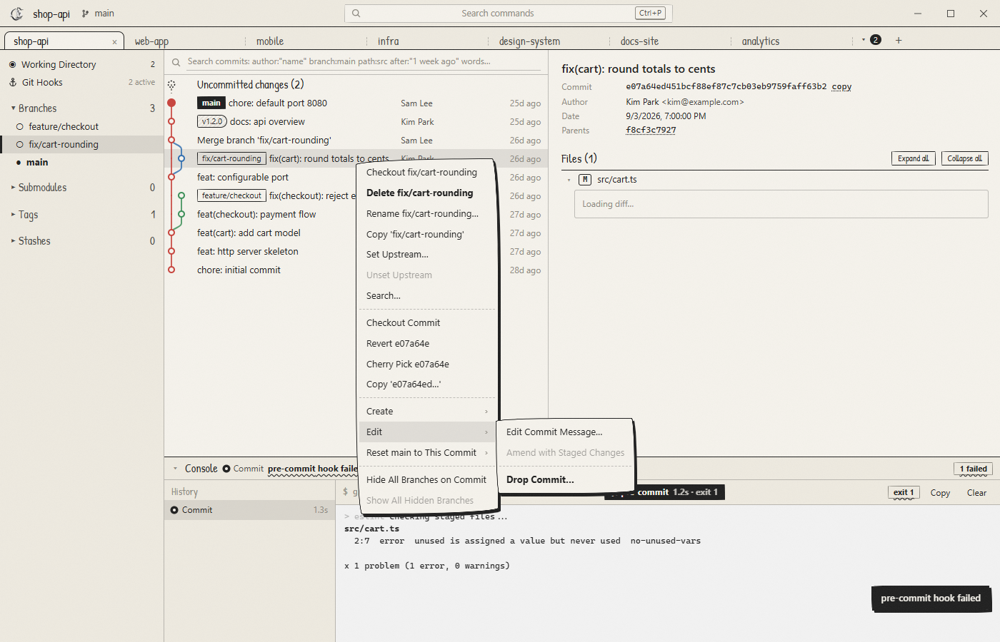
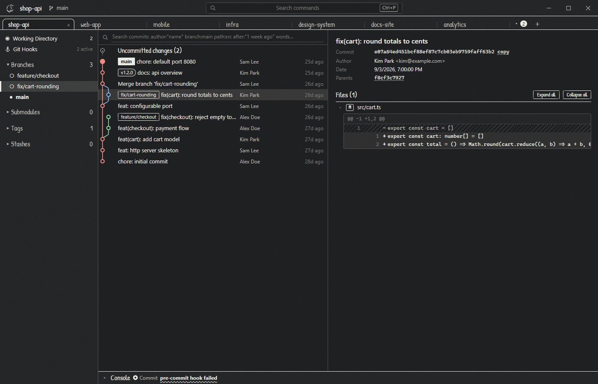
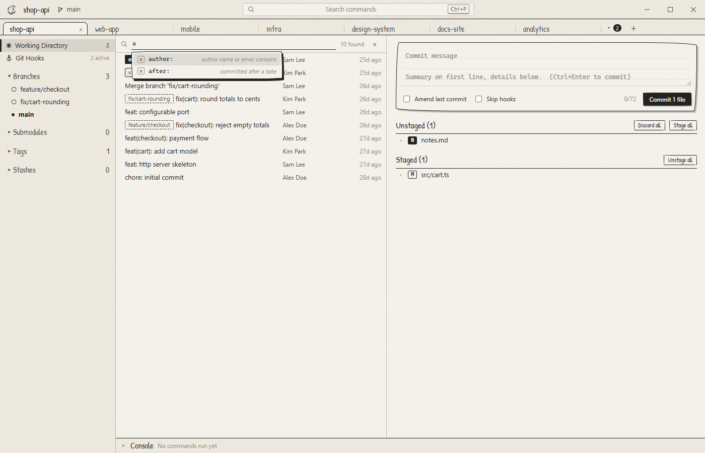

<p align="center">
  
</p>

<h1 align="center">Odysseus</h1>

<p align="center">
  A fast, keyboard-driven Git client for the desktop.<br>
  Built around the one thing most Git GUIs get wrong: <b>Git hooks</b>.
</p>

<p align="center">
  <a href="https://github.com/dewabuanam/odysseus/releases/latest">Download</a> ·
  <a href="#features">Features</a> ·
  <a href="#search">Search</a> ·
  <a href="#keyboard">Keyboard</a> ·
  <a href="#building-from-source">Build</a>
</p>



---

## Why Odysseus

Most Git GUIs treat hooks as an afterthought. A pre-commit hook that works in your terminal fails in the GUI with `command not found`, its output arrives as one unreadable blob after the fact, you can't tell which hook failed, and a hung hook freezes the app. Odysseus runs everything through the real `git` CLI, in your real shell environment, and shows you exactly what your hooks are doing while they do it.

It is also built to stay out of your way: every action is a keystroke away through the command palette, many repositories stay open in tabs, and every git command waits its turn in a per-repository queue.

## Download

Grab the latest build from [Releases](https://github.com/dewabuanam/odysseus/releases/latest):

| File | What it is |
|---|---|
| `Odysseus-<version>-setup.exe` | Windows **installer** (recommended). Installs for you or for all users, adds Start menu and desktop shortcuts and an uninstaller, and **installs Git for you** when it's missing. |
| `Odysseus-<version>-portable.exe` | Windows, single file, **no install**. Keeps its settings in an `odysseus-data` folder next to the exe, so it runs from a USB stick. |
| `Odysseus-<version>-win.zip` | Windows, unzip and run `Odysseus.exe`. Add an empty `odysseus-data` folder beside it for portable mode. |
| `odysseus-codesign.cer`, `install-certificate.ps1` | The public certificate the builds are signed with, and a script that trusts it. See [Code signing](#code-signing). |
| `SHA256SUMS.txt` | Checksums of every file above. |

Odysseus requires **Git 2.36+**. The portable and zip builds use the `git` on your `PATH`.

### The installer and Git

Before installing anything, `setup.exe` looks for Git 2.36 or newer (on `PATH`, in the Git for Windows registry entry, and in the default install folders). If Git is missing or too old:

1. Setup tells you it will install Git for Windows first. Cancel stops the whole setup.
2. It downloads the latest official Git for Windows installer (64-bit or ARM64) from `github.com/git-for-windows`.
3. It checks the download's digital signature and only runs it if it's validly signed by the Git for Windows maintainer.
4. Git installs silently with its default options. Windows asks for administrator permission for this step only.
5. If anything fails (offline, permission declined), you can **Retry** or cancel. Setup doesn't continue without Git.

Silent installs (`setup.exe /S`) do the same without prompts and exit if Git can't be installed.

### The installer and AI tools

After installing the app, setup checks for the AI command-line tools the AI pane runs: **Claude Code** (`claude`), **Codex**, **Gemini** and **GitHub Copilot CLI**. It lists the missing ones and asks before installing them for your user account: Claude Code with its official installer from claude.ai, the others with npm (they need Node.js and are skipped without it). Nothing here stops setup. A tool that's still missing is installed the first time you open it in the AI pane.

### Code signing

The Windows builds are signed with a **self-signed** Odysseus certificate (thumbprint `8BA7F8403BDBDB07C8ADA30688B5D1FE6293C9D1`). It isn't issued by a public certificate authority, so until you trust it, Windows shows the publisher as unknown. To trust it for your Windows account, download `odysseus-codesign.cer` and `install-certificate.ps1` from the release into one folder and run:

```powershell
powershell -ExecutionPolicy Bypass -File install-certificate.ps1
```

The script refuses a certificate with any other thumbprint. Windows asks you to confirm, and no administrator rights are needed. After that, the installer and app show **Odysseus** as a verified publisher. To undo it, run the script with `-Remove`.

SmartScreen can still show *Windows protected your PC* for a new release until the download builds reputation. Choose *More info*, then *Run anyway*. You can also check a file yourself: right-click it, choose *Properties*, then *Digital Signatures*.

Only trust a certificate if you trust where it came from. You can always skip this and compare a file's hash against `SHA256SUMS.txt` instead.

## Features

### Hooks, done right



- **Live hook tracking.** Odysseus reads git's own `trace2` event stream, so it knows which hook is running, for how long, and how it exited: `pre-commit ✗ 1.2s · exit 1`.
- **Streaming output** with colors, in a console per repository.
- **Hooks find your tools.** Your login-shell environment is loaded (nvm, volta, asdf, pyenv, homebrew), Git for Windows' tools are on the path, extra PATH entries can be added in Settings, and the Hooks view warns about commands your hooks call that can't be found.
- **Cancel or time out** a hook and the whole process tree is killed, including MSYS children on Windows.
- **A failed commit keeps your message.** Retry, or commit with `--no-verify` after an explicit confirmation.
- **Formatter changes are caught.** When a pre-commit hook rewrites staged files, Odysseus tells you and offers to stage the result.
- **Hooks view.** Every hook in the repository, `core.hooksPath` support, husky / lefthook / pre-commit / overcommit / simple-git-hooks detection, edit, enable or disable, fix the executable bit, and **run a hook on its own** without committing.

### Command palette with options



Press **Ctrl+P**. Every action lives there, with fuzzy matching (`chk` finds *Checkout*). Choosing a command shows its options with the exact git command next to each, before anything runs: push with or without upstream, force-with-lease, no-verify, tags; pull by merge, rebase or fast-forward; merge with `--no-ff`, `--ff-only` or `--squash`. Inputs come pre-filled: your draft commit message with conventional-commit prefixes, the next semantic version for a tag, `feature/` and `fix/` for branch names. Arrow keys fill the input from the suggestions, Tab completes, Backspace steps back. Commands keep a fixed order with the everyday ones first (pull, push, commit, AI, fetch, checkout), so typing `p` always offers *Pull* first, then *Push*.

### Tabs and a command queue

- Open any number of repositories in **tabs** on their own row. Tabs that don't fit go into the **▾** menu next to **+**; picking one from there moves it into the visible row (the last visible tab moves into the menu). Tab order is restored on launch. Give a repository its own name with **Rename…** on the tab's right-click menu (or **Tab: Rename Repository…**); the name shows on its tab, in the AI pane and in the recent list, and an empty name goes back to the folder name.
- **Every git command is queued per repository** and runs strictly in order. Pull, checkout another branch, pull, checkout, pull: fire them as fast as you like and they run in exactly that sequence, never two at once. Queued commands show in the console with a button to drop them.
- **Command history** of every command, its output, exit code and failing hook, kept across restarts (Ctrl+H).

### Workspaces

Group tabs into **workspaces**, like browser tab groups. Each workspace is a colored chip in the tab row. Workspaces stay expanded with all their tabs until you click a chip to collapse it; the workspace holding the current tab is always expanded. Click a collapsed chip to expand it and switch to that workspace, at the tab you last used there. Collapsed and expanded workspaces stay that way after a restart.

- **Workspace: New from Folder** opens every repository in a folder (or the folder itself) as one group. Right-click a tab to add it to a workspace or take it out.
- Right-click a chip to rename it, change its color or folder, open the AI there, ungroup, or close the workspace with its tabs.
- Each workspace has a **folder** (by default the folder its repositories live in). The AI pane can start there, so one AI session can see every repository in the workspace.

### AI and terminal pane

The **Claude Code** button in the title bar (or **AI: Open** in the palette, or Ctrl+Shift+T) opens a pane on the right with your AI coding tool running in the current repository, or in the workspace folder when the tab belongs to a workspace (switch with **Workspace / Repository**). Sessions are real terminals and keep running while the pane is hidden. When you reopen Odysseus, the pane comes back as you left it: shown or hidden, with the sessions of every tab and workspace still open, and each Claude Code session resumes its own conversation. Start more from the pane: your default AI, Codex, Gemini, Copilot, or a plain PowerShell. The default AI, the shell and the list of programs are in **Settings > Terminal pane** and **Preferences: Default AI** in the palette. A program that isn't installed yet is installed with its official command the first time you start it. App shortcuts take priority over the pane: a key bound in your keymap runs the Odysseus command even while you type in a session. When Odysseus is fullscreen and the taskbar is hidden, a notification tells you when an AI needs your input or all AI work is done.

**AI commands in the palette.** The default AI's slash commands are palette commands named after it: built-ins, your skills and custom commands, the project's, and installed plugins'. *Claude: Commit* types `/commit` into the session in view (starting one if needed); press Enter to add text after it first. The text waits until the AI is ready at its prompt.

**Remote Control.** Lets you continue Claude Code sessions from claude.ai or the Claude app. It has a default for every repository and workspace (**AI: Turn Remote Control On/Off by Default**, or Settings), and each repository or workspace can have its own setting: the **Remote** button in the AI pane (or **AI: Toggle Remote Control Here**) switches it for the one in view. Settings lists every repository and workspace with its own setting, with **Use default** to follow the default again. The first time, a window explains it and asks whether to turn it on everywhere or only here. Sessions already open get it right away and show a *remote* badge. It needs a claude.ai login on a Pro, Max, Team or Enterprise plan.

### Context menus



Right-click a commit or a branch for full context menus: checkout, delete, rename, copy, set or unset upstream, search a branch's history, hide branches, revert, cherry-pick, create a branch or tag, **edit the message of any commit**, amend, drop a commit, and reset (soft, mixed, hard).

### Everything else

- **Stage by file, hunk or line** with buttons. The UI updates instantly and git confirms right after.
- **Conflict resolver**: when a merge, rebase, pull, cherry-pick or stash stops on conflicts, a window opens with every conflicted file. Each conflict shows both sides next to each other; pick one side, both in either order, or edit the merged result by hand, then save and mark it resolved. Binary and deleted-on-one-side files offer keeping a version or deleting. When the last file is done, continue the operation from the same window.
- **Submodules**, nested ones included: state at a glance, open in a tab, update, add, sync, deinit, and pull or fetch recursively.
- **Stashes, tags, remotes**, fetch / pull / push with upstream setup.
- **Recovery prompts**: when local changes block a command, stash them, retry, and restore them; when git has no author identity, set it in two keystrokes.
- **Paper & pencil look** in black and white, with colored-pencil graph lanes (branch labels take the color of their line, favoring the checked-out branch, then the newest), and a **chalkboard** dark theme.
- **Drawings from the Odyssey** in quiet places: the welcome screen, a clean working tree, an empty history and a search with no results. Graphite on paper, chalk on the chalkboard, never in the way of your work.



## Search



**Ctrl+F** opens commit search. It runs on git itself, so it covers the whole history, not just what's loaded. Combine keys and bare words; keys autocomplete as you type, and so do their values (branches, authors, dates).

```
author:"Sam Lee" branch:"main" after:"2 weeks ago" path:src/cart.ts rounding
```

| Key | Finds commits… |
|---|---|
| *bare words* | whose message contains every word (a hex word also matches a commit hash) |
| `author:` / `committer:` | by a name or email (`author:me` is you) |
| `after:` / `before:` | committed after / before a date (`yesterday`, `1 week ago`, `2026-01-01`) |
| `date:` | committed on one day |
| `branch:` / `tag:` | reachable from a branch, tag or commit |
| `path:` | touching a file or folder |
| `ext:` | touching files with an extension (`ext:vue`) |
| `message:` | whose message contains a phrase |
| `regex:` | whose message matches a regular expression (`regex:"^(feat\|fix)"`) |
| `hash:` | whose hash starts with |
| `contents:` | whose diff adds or removes lines matching a regex |
| `string:` | whose diff changes how often an exact string appears |
| `merges:` | `only` merge commits, or `none` |
| `max-parents:` / `min-parents:` | by number of parents (`max-parents:1` hides merges) |
| `first-parent:` | on the mainline only |
| `limit:` | at most N results (default 10000) |

## Keyboard

The default shortcuts are below. **Settings > Keymap** switches to **VS Code**, **JetBrains** (IntelliJ, Rider, WebStorm, with double-Shift for the palette) or **Visual Studio + ReSharper**. **Ctrl+/** lists every binding of the active keymap.

| Key | Action |
|---|---|
| Ctrl+P | Command palette |
| Ctrl+F | Search commits |
| Ctrl+K | Commit (options, then message) |
| Ctrl+Shift+C | Write the commit message in the editor |
| Ctrl+Enter / Ctrl+Shift+Enter | Commit / commit without hooks |
| Ctrl+Shift+A / Ctrl+Shift+U | Stage all / unstage all |
| Ctrl+B / Ctrl+Shift+B | New branch / checkout branch |
| Alt+F / Alt+L / Alt+P | Fetch / pull / push |
| Alt+S / Alt+Shift+S | Stash / pop stash |
| Ctrl+G / Ctrl+Shift+G | Go to branch / go to commit |
| Ctrl+0 | Working directory |
| Ctrl+H / Ctrl+Shift+H | Command history / hooks |
| Ctrl+T / Ctrl+W | New tab / close tab |
| Ctrl+Tab / Ctrl+Shift+Tab / Ctrl+1..9 | Next / previous / nth tab |
| Ctrl+\` / Ctrl+\\ | Toggle console / sidebar |
| Ctrl+, | Settings |
| Ctrl+Shift+T | Toggle the AI / terminal pane |
| F5 | Refresh |

## Building from source

```bash
git clone https://github.com/dewabuanam/odysseus.git
cd odysseus
npm install
npm run dev             # run with hot reload
npm test                # end-to-end tests of the git engine against real repositories
npm run dist:portable   # Windows portable .exe into dist/
npm run dist:win        # signed Windows release: setup.exe, portable.exe, zip, checksums
npm run dist            # every target for the current OS
```

`npm run dist:win` signs with the key in `%USERPROFILE%\.odysseus-signing\` and builds unsigned when that key isn't there. To create a signing key, run `scripts/new-signing-cert.ps1`. It writes the private `.pfx` and its password to that folder, outside the repository, and exports the public certificate to `certs/`. Never commit the `.pfx`. `.gitignore` excludes `*.pfx`, `*.p12` and `*.key`. The installer's Git check lives in `installer/`.

Odysseus is built with Electron, React and TypeScript. The git engine (`src/main/git`) drives the real `git` CLI; the test suite (`scripts/smoke-test.ts`) exercises it end to end: hooks, the queue, conflicts, history editing, submodules and search.

## License

MIT
